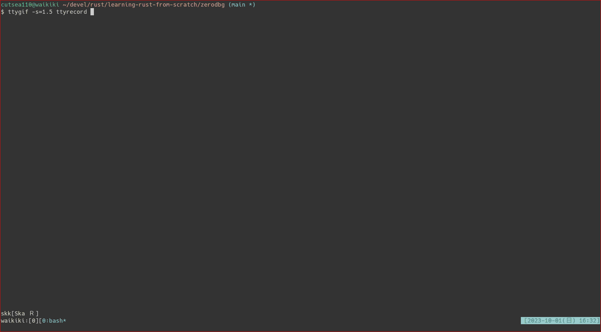

# learning-rust-from-scratch

refs.)
- [Textbook](https://www.amazon.co.jp/gp/product/4065301955/)
- [for implementing parser combinator by myself](https://bodil.lol/parser-combinators/)

## zerosh

a shell implementation written in Rust.

[youtube]: https://www.youtube.com/watch?v=DqI9M_raCI4

## zerodbg

a debugger implementation written in Rust.

[youtube]: https://www.youtube.com/watch?v=7OVzFflNoQo
